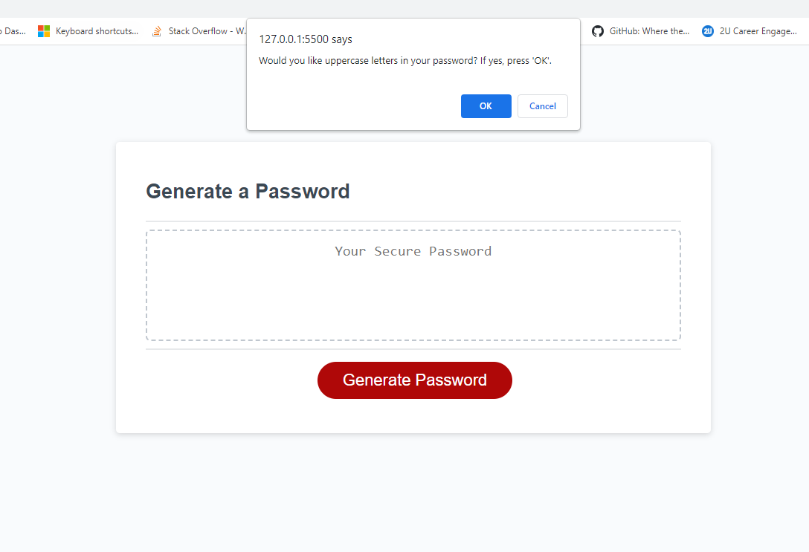

# Password-Generator
This Password Genreator Project focused on adding and developing code to provided HTML, CSS and Script sources. Goals of this project  knowedge and application of Java-Script specifically studying strings, variables, functions, arrays, If-Else, concat, DO-WHILE loops, and event-listener. 

# Usage
 This practice will provide future potential employers the opportunity to see student works in early learning of Java-Script. 

# Features
This deployed and functional password generator will engage the user in a series of prompts asking the length and character choices of the password. When at least one character choice has been selected, the site will produce a generated password. This site limits the password be between 8 and 128 characters and will alert the user to some possible errors. 

# User Story (Provided)
AS AN employee with access to sensitive data
I WANT to randomly generate a password that meets certain criteria
SO THAT I can create a strong password that provides greater security

# Links
[Link to Deployed Password Generator] (https://mwambaugh.github.io/Password-Generator/) 
[Link to GitHub Code] (https://github.com/mwambaugh/Password-Generator)

# Visuals 

# Contributing:
This assignment was worked on by student, M.C. Wambaugh, with the support of her instructor John, TA's via Slack for Repo bug support, Study-grouping through pseudo code, studying Java-Script semantics and discussing loop trials with classmates such as Zack Bieser via SLACK, tutors for Pseudo code and discussing Java-Script functions and semantics, W3schools.com, FreeCodeCamp.org, the Class 'Resources' tab via Slack. Many thanks to those who continue to support learning in the technological community.

# License 
[MIT](https://choosealicense.com/licenses/mit/) 

# Acceptance Criteria (Provided): 
GIVEN I need a new, secure password
WHEN I click the button to generate a password
THEN I am presented with a series of prompts for password criteria
WHEN prompted for password criteria
THEN I select which criteria to include in the password
WHEN prompted for the length of the password
THEN I choose a length of at least 8 characters and no more than 128 characters
WHEN asked for character types to include in the password
THEN I confirm whether or not to include lowercase, uppercase, numeric, and/or special characters
WHEN I answer each prompt
THEN my input should be validated and at least one character type should be selected
WHEN all prompts are answered
THEN a password is generated that matches the selected criteria
WHEN the password is generated
THEN the password is either displayed in an alert or written to the page